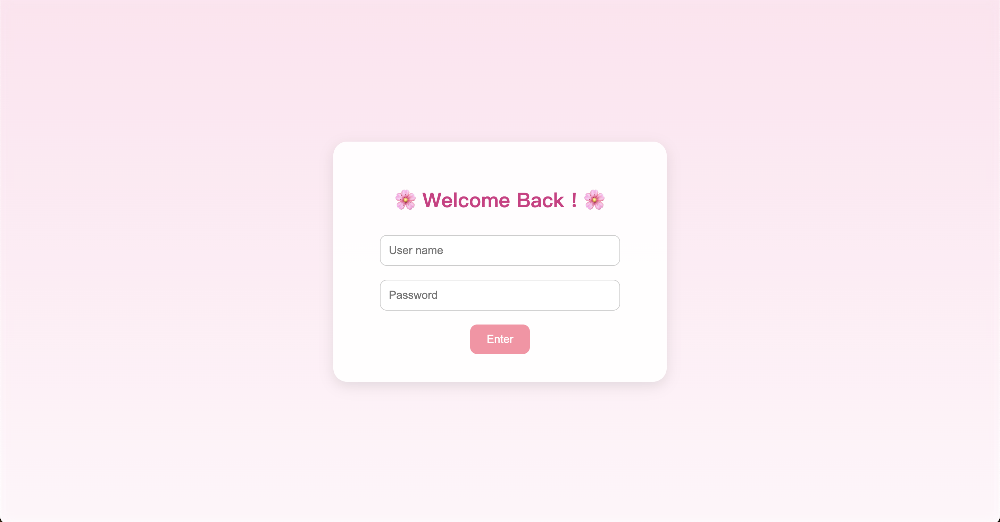

# Period Tracker Website

A lightweight, user-friendly period tracking web app built with Flask. This app allows users to log their period days on an interactive calendar, track statistics such as average cycle length and predicted ovulation, and optionally receive reminders via SMS.

---

## 🛠️ Installation & Setup

### 1. Clone the Repository and Install Dependencies

```bash
git clone https://github.com/bbbjiangggg/PeriodTracker.git
cd PeriodTracker
conda env create -f environment.yml
conda activate period
```

### 2. Running the Website

```bash
python app.py
```
The log-in user name and password are defaulted to "your-username" and "your-password". These can be easily modified in app.py.

### Log in page
Simple login form to authenticate user access.



### Statistics Dashboard
Displays average cycle length, predicted ovulation day, and other key stats.


### Calendar Tracker
Interactive calendar to mark and review period days.


